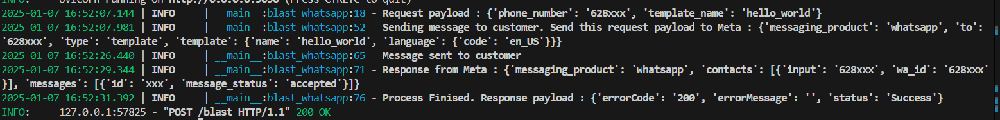

# whatsapp-blast

request payload :
{
	"phone_number":"628xxx",
	"template_name":"hello_world"
}

response payload ketika Success :
{
	"errorCode": "200",
	"errorMessage": "",
	"status": "Success"
}

Lampiran

